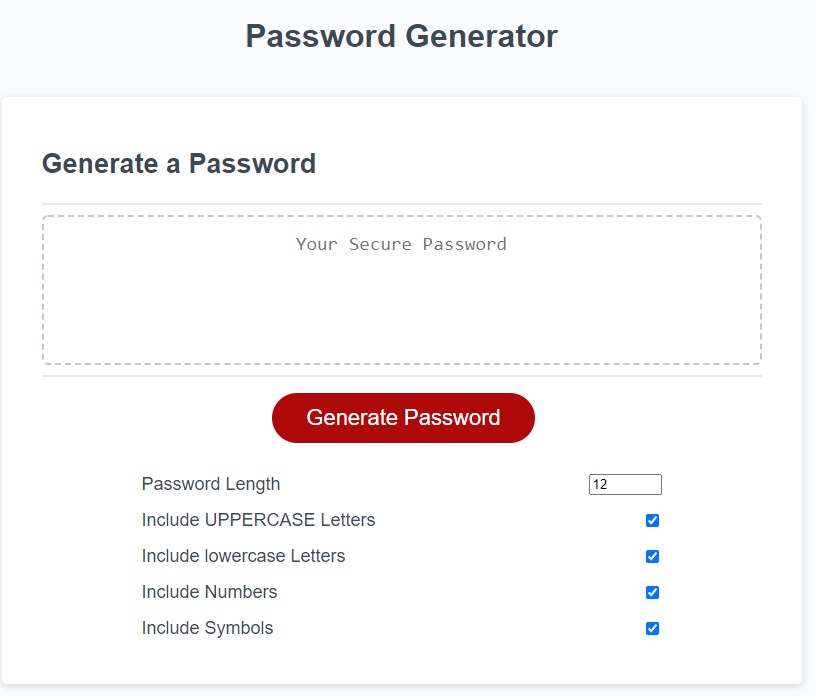

# password_generator

## Random Password Generator in JS

Link to live site: [Password Generator]("https://clarissareeve.github.io/password_generator/")

### Credits

I watched the following YouTube Videos:
[Traversy Media](https://www.youtube.com/watch?v=duNmhKgtcsI) and [
Web Dev Simplified](https://www.youtube.com/watch?v=iKo9pDKKHnc)
